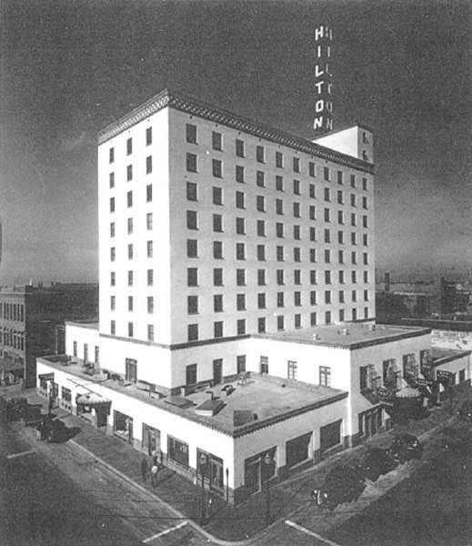
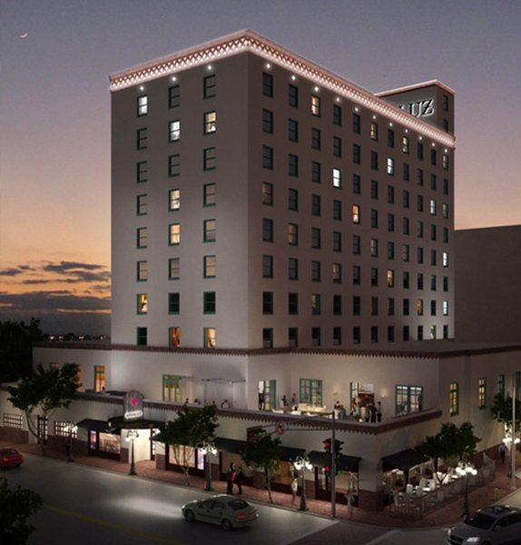
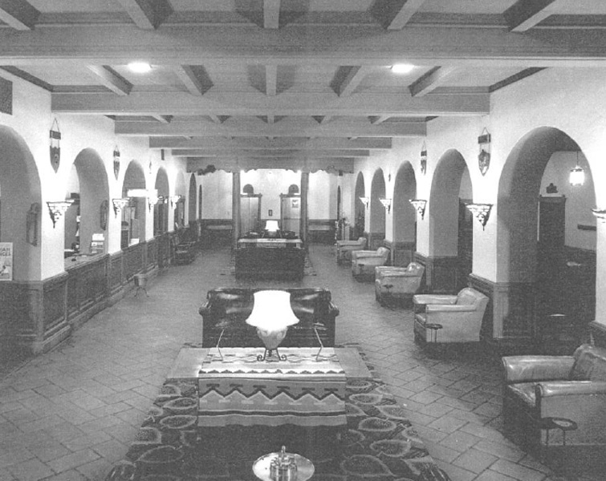
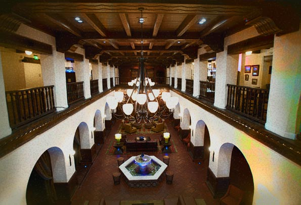
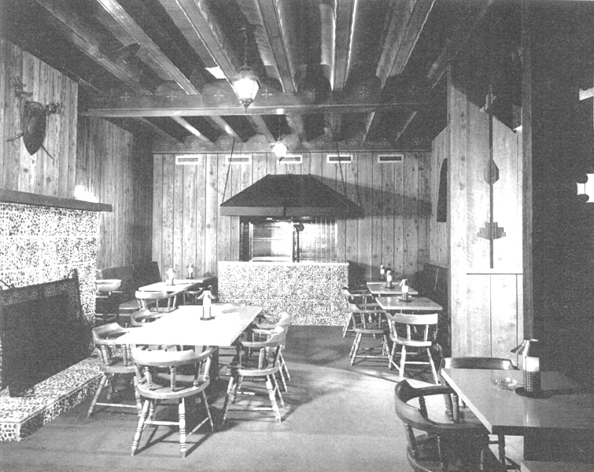
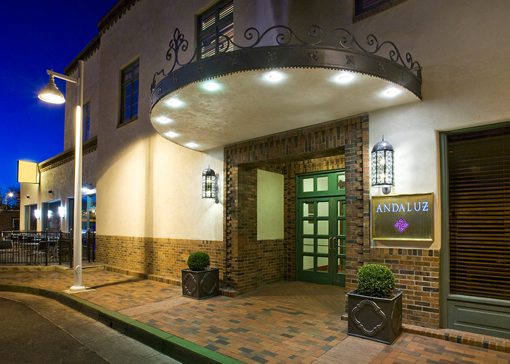
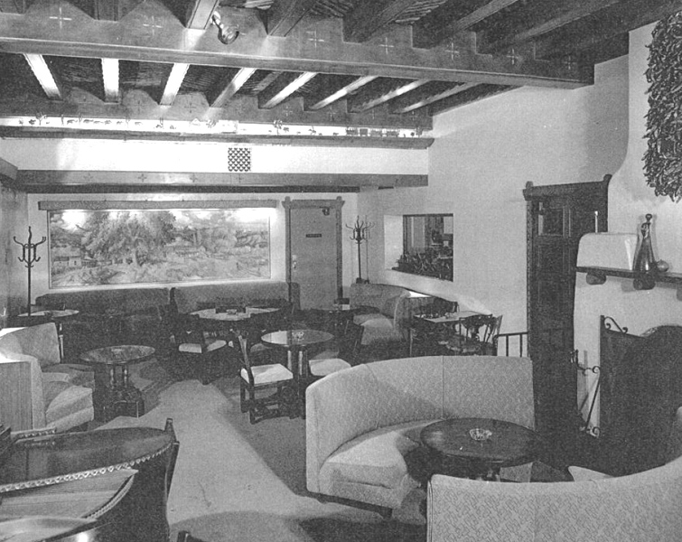

---
---

#Hotel Andaluz#

{% include figure.html
  class="img-right"
  width="33%"
  caption="Historic Andaluz"
  src="images/AndaluzH1.jpg"
%}



 

#Space#

The Hotel Andaluz is located at 125 2nd St NW, Albuquerque, NM. The building was built on June 9, 1939 and originally named the Hilton Hotel, after the original owner and native New Mexican Conrad Hilton. This building at the time was the tallest building in New Mexico and had the first air conditioner and elevator with 176 rooms. The property was sold twice being renamed to Hotel Plaza and then Hotel Bradford but never opened. Again in 1983 the hotel was sold and named Southwest Resorts and was renovated with 114 rooms and four suits. A year later the hotel re-opened as La Posada de Albuquerque. By 2005 the building was up for auction and was up for auction. The hotel was the last of three historic hotels that Albuquerque had. Gary Goodman went to the auction with no intentions of buying anything, he felt the need to preserve the historical property to New Mexico instead of allowing other international chains to take over the hotel. He purchased the hotel for $4 million and in 2005 renamed the hotel to Hotel Andaluz.

#Architecture#

The original architect of the building was Anton F. Korn who designed the ten-story building in a New Mexico Territorial style. He used an earth tone stucco, brick coping along the roofline, and southwest-style woodwork and furnishings. Korn initially considered this style as well, proposing a building with rounded corners and protruding vigas around its base, before he turned in the executed design to the crisper massing and brick cornices of the typical style.

John Gaw Meem and Willard C. Kruger had revived this style in the 1930s as a more formal alternative to the hybrid Spanish-Pueblo Style, and its formality made it well-suited to the rectilinear precision and planarity of the Hilton Hotel’s structure of cast-in-place concrete. The two-story entrance lobby tempered this modernity, and its promise of comfort, with tile floors and ornamental details in carved wood, round arches overlooked by balconies and a beamed ceiling above, and murals by Ben Turner and Lloyd Moylan: New Mexican, Mexican, and Spanish motifs are freely combined in a romantic evocation of the Land of Enchantment. The new property features Más restaurant, the rooftop bar Ibiza and 6,000 square feet of conference facilities.

#Style#

The hotel in full is full of are from the large lobby mural, along with many art events throughout the week, as well as an over 3000 square foot gallery. Much of the building is salvaged of its original décor and materials, it also has large restroom vanities from 1980’s celling remnants, original recrafted bed frames, and the table tops from the restaurant are made of recycled cork. The newest features incorporate a geothermal water-heating system that keeps greenhouse gases out of the atmosphere as well as a rooftop rainwater-capturing system to water plants. Hotel Andaluz is one of two hotels in the United States to have a LEED-Gold certification and apart of the National Register of Historic Places.

#Location#

Hotel Andaluz is located surrounded by a variety of places of interest and things to do. J C’s New York Pizza Department is a family pizza and pasta dine-in or take out restaurant. The Library Bar & Grill and Lotus Night Club are adult joints for nights out dancing and dining. Historic Sunshine Theater right up the road, great for couples and families fond of plays and theater performances happen regularly. If not up for that type of theater the downtown Century 14 movie theater is equip for great movie watching experience. The location of the hotel in Downtown Albuquerque makes it easy to jump on the New Mexico Rail Runner that makes various stops throughout central New Mexico from Belen to Santa Fe.

https://www.theclio.com/web/entry?id=41541
http://sah-archipedia.org/detail%2Fcontent%2Fentries%2FNM-01-001-0027.xml?q=style%3A%22Territorial%20Style%22
http://www.hotelandaluz.com/green-initiatives/
http://www.hotelandaluz.com/wp-content/uploads/sites/391/2016/12/Hotel_Andaluz_fact_sheet_2014.pdf
http://www.hotelandaluz.com/wp-content/uploads/sites/391/2016/12/Details-Magazine.pdf
