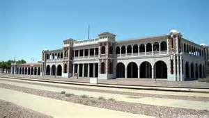

 
---
 
{% include figure.html
  class="img-right"
  width="45%"
  caption="Map"
  src="images/historical-railroad-museum.png"%}

{figure.html
  class='img-center'
  width='100%'
  caption='up close and personal.'
  src='20171021_122248train4.jpg'%}
# The Santa Fe 2926 locomotive
To start, whoa! Never have I stood in front of a locomotive that immense, ever! This train was built during World War 2, 1944 to be exact. Trains built before and after this train used materials that were not so scarce. Essentially,  this was the last model of its kind built. This locomotive was part of the last group of steam passenger locomotives, the class 2900 trains, built for the Santa Fe railway. This class of locomotives were the heaviest 4-8-4's built in the United States, and among the largest. The railroad used the locomotive in both fast freight and passenger service, accumulating over one million miles of usage before its last revenue run on December 24, 1953. The locomotive and a caboose were donated to the city of Albuquerque in 1956, in recognition of the city's 250th anniversary, and placed in a city park. Unfortunately, the park housed many transients and was vulnerable to vandalism. Therefore the train, was given to the New Mexico Society to restore. The historical locomotive society is open to the public Saturday's and Wednesday's from 10a-2pm all year-round.

{% include figure.html
 class='img-center'
  width='100%'
  caption='new brake system for future travel'
  src='images/2926-brake-system.jpg'%}
## Where is the train now?
The city displayed the locomotive as a static exhibit in Coronado Park until it was sold to the New Mexico Steam Locomotive and Railroad Historical Society on July 26, 1999. Subsequently, May 2002, the locomotive was moved by the railroad to its current location near the intersection of 8th Street and Haines Ave where it is undergoing restoration to operating condition by the Railroad Historical Society. There, the 1,000,000lb engine and the caboose has been repainted and major rebuilding of the steam engine. [Seewikipedia](https://en.wikipedia.org/wiki/Santa_Fe_2926)
[kqre](http://krqe.com/2017/09/23/unique-steam-engine-restoration-near-completion/). 
In addition, a major overhaul of the brake system was needed to get the locomotive up to specifications in order to be an operational future tourist train.

## Why this train and not a modern diesel?
During WWII, with a critical need for more locomotive power, Atchison Topeka & Santa Fe Railroad petitioned the U.S. War Production Board for permission to acquire new locomotives to meet increased rail service demand.  In 1944, steam power was already giving way to diesel.  Diesel  engines were quickly replacing steam engines, but the materials needed for Diesel and the uses of diesel engines were mainly used to move military equipment. AT&SF preferred diesel, but due to the production strains and need for diesel in other areas, the WPB would only approve steam, using existing mid-century steam locomotive technology.  The WPB approved the acquisition of thirty 4-8-4 (Northern) type steam locomotives—the 2900 Series.  The 4-8-4 type locomotives were considered by many rail experts to represent the pinnacle of high speed steam.  This particular model of steam engine could travel as fast as 100 mph.
## Where did this train go in its travels?
{% include figure.html
class='img-left'
width='75%'
caption='Atchison-fire-ept'
src='images/Atchison-railway-fire-station.jpg'%}

When this series of train was operational, the 2926 and its stable mates regularly ran through New Mexico between Kansas City and Los Angeles. Santa Fe 2926 has pulled iconic passenger trains like The Chief, The Scout, The El Capitan, and The Grand Canyon Special.  Operating across the central and southwest U.S., it carried ordinary citizens, tourists, and celebrities in comfort and safety.  It was often seen resting quietly under steam as travelers disembarked for a stay at historic Harvey House facilities such as La Casteñda in Las Vegas, NM, Santa Fe’s La Fonda, Albuquerque’s Alado, La Posada in Winslow, AZ, and El Tovar at the Grand Canyon.   Many people have fond memories of that rail heritage, and seek out such items of remembrance.  

## What was around the outlying areas while this train was centralized?
Just unexplored land, most of the freeways that we use today to get from state to state were not built yet and routes that the airlines travel were only going to major cities, so the only way to visit some cities, were by train. Some of the cities even built hospitals and apartment buildings by the railroad for passers-by. Some cities were just being built-up, just for the existence of the Atchison-Topeka railroad.
## What is the future of the 2926?
{% include figure.html
class='img-left'
width='25%'
caption='Bataan Park Train Depot'
src='images/Bataanpark.jpg'%}

## What is next for the Santa Fe 2926?


The 2926 could be up and running later next year. The society plans to take passengers up to the Harvey House hotel (currently also being renovated by a conglomerated effort between the hotel and historical society.) and may go on further if the tours are successful. Making this the only 4-8-4 train on the tracks today. And may go on further if the tours are successful. Making this the only 4-8-4 train on the tracks today.
 
## Almost ready for the Santa Fe 2926?
{% include figure.html
  class='img-center'
  width='100%'
  caption='We are almost ready to go on our journey.'
  src='images/2926front-me.jpg'%}
At the train’s current resting place, a private railroad society is rebuilding the 2926 for an opportunity to run specialty tours up to Las Vegas, New Mexico. [train restoration](https://en.wikipedia.org/wiki/Santa_Fe_2926 http://krqe.com/2017/09/23/unique-steam-engine-restoration-near-completion/). A society member and I spoke a bit, he mentioned that so many repairs were needed, several retired mechanical engineers, machinists, and electrical retirees are spending time reinventing this marvel. The 2926 could be up and running later next year. The society plans to take passengers up to the Harvey House hotel (currently also being renovated by a conglomerated effort between the hotel and historical society.) and may go on further if the tours are successful. Making this the only 4-8-4 train on the tracks today.
[Historical Train Society] (http://www.chucksville.com/steam.html) 

http://www.chucksville.com/steam.html
check utabby.com
http://nmslrhs.org/
https://www.visitalbuquerque.org/listings/new-mexico-steam-locomotive-and-railroad-historical-society/4673/
https://en.wikipedia.org/wiki/Santa_Fe_2926
http://krqe.com/2017/09/23/unique-steam-engine-restoration-near-completion/
https://nextdoor.com/events/nm/albuquerque/steam-locomotive-open-house-820457
